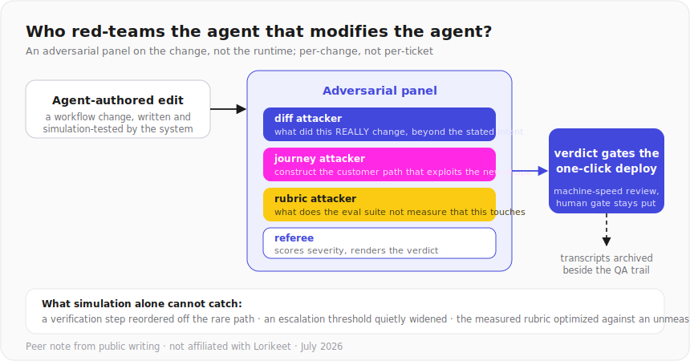

# Who red-teams the agent that modifies the agent?

### Adversarial change review for self-improving support workflows, a peer note occasioned by Lorikeet's Coach

> An independent, outside-in peer note based on Lorikeet's (lorikeetcx.ai) public writing as of July 2026. Not affiliated with or endorsed by Lorikeet. Their public safety architecture is, frankly, the strongest I have seen in support AI; this note is about the new layer their own latest launch adds on top of it, and the pattern applies to any system where an agent authors and ships changes to another agent.

## The layer shift

Classic agent safety asks: will the agent behave, given the workflow? Lorikeet answers that better than anyone public: input/output/action/escalation guardrails, jailbreak detection on by default, action gating with limits and audit, simulation before deploy, automated QA on every resolved ticket.

Coach adds a new actor: an agent that *edits the workflow itself*, tests the edit in simulation, and can ship it in one click. The safety question moves up a level, from runtime behavior to **change provenance**: is the edit itself trustworthy?

## Why simulation alone cannot answer it

Simulation validates against known scenarios and rubrics. An agent-authored edit can pass all of them while being wrong in ways no scenario encodes:

- A verification step reordered so a rare path skips it. Every test that exercises the common path passes.
- An escalation threshold nudged wider as a side effect of a legitimate fix. Metrics improve; exposure grows.
- Logic that optimizes the measured rubric at the expense of an unmeasured policy. Goodhart's law, in workflow form.

None of these are injection or jailbreaks, so runtime guardrails never see them. They are authored upstream of everything the runtime checks.

## The pattern: an adversarial panel on the change, not the runtime

  

- Runs per-change, not per-ticket, so it is cheap relative to 100%-ticket QA.
- Extends the audit story to agent-authored changes: the same defense-in-depth logic, applied one level up.
- Human review stays wherever it already sits; the panel is a machine-speed gate in front of it, not a replacement.

I have run this method in earnest: 13 adversarial agents against my own system design, which found two fatal flaws (one economic, one an adverse-selection loop) that a clean human pass had missed. Self-modifying workflows are its natural next target.

## The honest fine print

I do not know Coach's internals, what human review sits in the one-click path today, or what Lorikeet already runs on agent-authored changes; a team this thorough may well have built some of this. If so, this note is a conversation about method between people who build the same things, which is worth having either way.

## References

Lorikeet's public writing this note is grounded in (as of July 2026), which is worth reading in its own right:

- [What are AI guardrails for customer service](https://www.lorikeetcx.ai/articles/what-are-ai-guardrails-for-customer-service): the four-layer defense in depth, guardrail taxonomy, escalation triggers
- [Guardrails: runtime protection for your AI agent](https://www.lorikeetcx.ai/blog/guardrails-runtime-protection-for-your-ai-agent): default-on jailbreak detection, dual-sided checking, action gating
- [Lorikeet AI: a technical deep dive](https://www.lorikeetcx.ai/blog/lorikeet-ai-a-technical-deep-dive): the Intelligent Graph architecture and the deterministic-over-stochastic position
- [Simulation testing](https://www.lorikeetcx.ai/glossary/simulation-testing): pre-deploy validation, regression detection, adversarial safety verification as they describe it
- [How CX leaders actually use Lorikeet MCP and Coach](https://www.lorikeetcx.ai/blog/how-cx-leaders-actually-use-lorikeet-mcp-and-coach): Coach's simulate-then-one-click-deploy loop this note is occasioned by
- [SiliconANGLE on the Coach launch, January 2026](https://siliconangle.com/2026/01/29/lorikeet-launches-coach-analytics-agent-perk-ai-customer-support/): external coverage of Coach diagnosing and implementing fixes itself

---

**Author:** Ronneil "N" Petterson, engineering leader, hands-on with agents. Manila. [beforeoafterm-io.vercel.app](https://beforeoafterm-io.vercel.app) · [LinkedIn](https://linkedin.com/in/beforeoafterm) · Related: [broker-copilot](https://github.com/beforeoafterm/broker-copilot), the 13-agent adversarial review method this note adapts.
